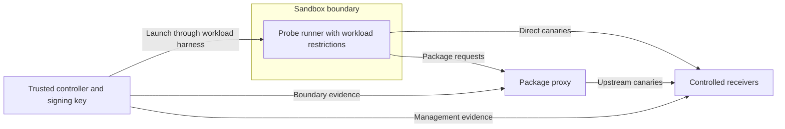

# Sealcheck

**Verify a sandbox's egress policy from the workload's security context, with signed evidence.**

Sealcheck runs synthetic probes inside a sandbox, correlates their results with controlled receivers outside the boundary, and signs a report from an external controller. It is an early security engineering tool, with a reproducible portable demo and a Linux isolation lab.



Reports answer **what was observed for this policy, probe set, identity, and time window**. They do not prove that every possible channel is closed. The project does not implement hardware remote attestation.

## Try the portable demo

Requirements: Go 1.24 or later. The core uses only the Go standard library. The demo opens loopback listeners; it needs no Docker or Internet access.

```sh
make test
make build
./bin/sealcheck demo --out out/demo
```

The demonstration produces:

1. **PASS:** the package proxy fixture denies forwarding and uploads while allowed controls work.
2. **FAIL:** a deliberately leaky fixture forwards canaries, follows redirects, and accepts a registry upload that an external reader retrieves.
3. **PASS:** restoring the proxy policy closes those tested paths.

The demo deliberately **allows its direct TCP, UDP, and DNS controls**. It demonstrates evidence collection and proxy behavior; it does not create an OS sandbox. Use the Linux lab for actual network isolation.

Each run gets `plan.json`, `results.json`, `witnesses.json`, `report.json`, `bundle.json`, and `summary.txt`. The signed bundle embeds all report evidence. `demo.json` identifies the three runs; private demo keys are ignored by Git.

Verify an archived demo report with an independently obtained public key:

```sh
./bin/sealcheck verify \
  --bundle out/demo/baseline/REPLACE_WITH_RUN_ID/bundle.json \
  --public-key out/demo/demo.pub.pem --historical
```

Historical verification checks the signature and internal consistency. To authorize a current evaluation, omit `--historical` and supply `--run-id`, `--policy`, and optionally `--max-age`. Obtain the expected run ID from the trusted controller, not from an untrusted report.

## Verdicts

| Verdict | Exit | Meaning |
|---|---:|---|
| PASS | 0 | Every required check has sufficient evidence that the tested policy held. |
| FAIL | 1 | A forbidden operation succeeded or an independent witness observed its canary. |
| INCONCLUSIVE | 2 | Required evidence is missing, a control failed, or execution was incomplete. Configuration errors also exit 2. |

A UDP send, a timeout, or an HTTP 403 does not establish denial. Kernel `EACCES`/`EPERM` and configured boundary witnesses can corroborate denials. A correlated external receipt takes precedence over an error or denial reported by the runner. Missing witnesses, restarted witnesses, and event-buffer overflow prevent PASS. Optional missing coverage is reported as SKIP; optional probes that demonstrate a leak still fail the run.

The `probe` command only emits observations; its exit code is not an evaluation verdict. Use `check`, `evaluate`, or current-context `verify` as the gate.

## Linux isolation lab

Requirements: Docker with Compose, IPv6-capable Linux container networking, Go, `curl`, and `openssl`. Docker Desktop uses its Linux VM. The lab reserves `172.30.56.0/24`, `172.30.57.0/24`, `fd53:ea1:56::/64`, and loopback ports 18080–18082.

```sh
make lab
```

The script builds the container image, creates an external signing key, runs baseline → proxy leak → remediation → direct IPv4/IPv6 leaks → restoration, and removes the containers. Reports remain under `out/lab-TIMESTAMP/`.

The sandbox's trusted initializer configures Linux `prohibit` routes and blocks management port 8081. The workload and runner then run as UID 10001 with capabilities dropped and `no_new_privs`. A `prohibit` route supplies explicit kernel denial evidence; silent packet dropping would produce INCONCLUSIVE without additional telemetry. The signing key and witness tokens stay on the controller side.

The Docker lab is a reference integration. Adapting it to another harness requires matching that harness's actual namespace, credentials, syscall filters, and process restrictions. `docker exec` by itself does not recreate a process's self-applied Landlock or seccomp restrictions.

## Use with a sandbox

Start controlled witnesses outside the sandbox, set their management tokens on the controller, and create a policy using [lab/policy.json](lab/policy.json) as the example. Then:

```sh
./bin/sealcheck keygen \
  --private-key out/controller.key.pem --public-key out/controller.pub.pem

./bin/sealcheck check --policy policy.json \
  --private-key out/controller.key.pem --out out/checks -- \
  your-trusted-launcher sealcheck probe
```

The launcher receives the run plan on stdin and must return runner JSON on stdout. Sealcheck never shell-interpolates the plan. It removes the configured witness-token variables from the launcher's environment. The launcher must supply workload credentials deliberately and keep the controller's files and management services outside the workload's reach.

For periodic checks:

```sh
./bin/sealcheck watch --policy policy.json \
  --private-key out/controller.key.pem --out out/watch \
  --interval 5m -- your-trusted-launcher sealcheck probe
```

`watch` writes verdict diffs and the next due time, and exits on FAIL, INCONCLUSIVE, an overdue iteration, or interruption. Your evaluation supervisor must stop the evaluation when that process exits unsuccessfully. An external supervisor must also detect a killed or stalled watcher; a process cannot attest its own continued liveness. Validate report age at consumption time.

For manual integrations, `plan`, `probe`, and `evaluate` expose the stages separately. Only feed `evaluate` witness files collected over a trusted external path. A signature cannot repair fabricated inputs. Run any command with `-h` for its flags.

## Coverage and project status

Implemented: TCP/UDP IPv4 and IPv6, direct and system-configured DNS canaries, direct HTTP(S), explicit HTTP forward proxy use, synthetic package-proxy fetch/redirect fixtures, private registry upload/readback, signed reports, offline verification, pre-flight gates, and periodic checks.

The Terraform, Cargo, and Ansible routes in this repository are **synthetic fixture routes**. They are not Artifactory exploit paths, and passing them does not attest an Artifactory deployment. Real Artifactory adapters require version-specific reproductions. Timing/certificate oracles, DoH/DoT, QUIC, production registry protocols, and native libc/NSS resolver behavior are not claimed as covered.

- [Threat model and trust boundaries](docs/threat-model.md)
- [Policy, commands, and report contract](docs/interfaces.md)
- [Coverage and validation matrix](docs/coverage.md)
- [Research and expansion criteria](docs/research.md)

## Development

```sh
make test  # race detector and integration tests using loopback sockets
make vet
```

CI runs tests, the portable demo, and the Linux lab. It uploads report evidence and public keys, excluding private signing keys. A successful workflow run is required before claiming the Linux lab has been validated on that runner.
